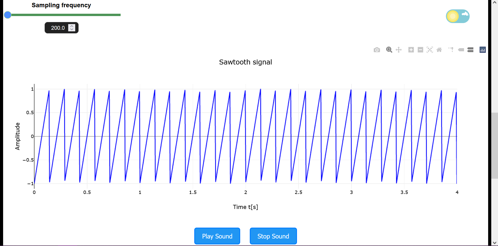
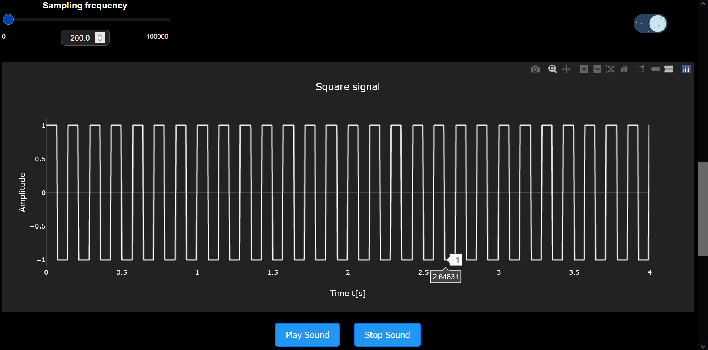

# 🎵 Custom Function Acoustics  

**Create, visualize, and listen to custom mathematical signals in real time.**  
An interactive Django-based web app combining **Python signal processing (NumPy, SciPy)** with **Plotly.js** frontend visualizations — all wrapped in a responsive **dark/light mode** interface.

---

## 🌐 Translations/Traduceri/Traduzioni

* [Română](docs/translations/readme-ro.md)
* [Italiano](docs/translations/readme-it.md)

---

## 📑 Table of Contents  
1. [Overview](#-overview)  
2. [Mathematical Foundation](#-mathematical-foundation)  
3. [Features](#-features)  
4. [Technology Stack](#-technology-stack)  
5. [Frontend Highlights](#-frontend-highlights)  
6. [Backend Overview](#-backend-overview)  
7. [Project Structure](#-project-structure)  
8. [Installation & Setup](#-installation--setup)  
9. [How to Run](#-how-to-run)  
10. [Screenshots](#-screenshots)  
11. [Animated Preview](#-animated-preview)  
12. [License](#-license)

---

## 🧭 Overview  

This web app allows users to design and explore **custom periodic signals** interactively.  

You can:  
- Choose a signal type (`sin`, `cos`, `tan`, `cotan`, `sawtooth`, `square`)  
- Adjust parameters like **frequency**, **amplitude**, **duration**, **phase**, and **sampling rate** (**when selecting high values for frequency and sampling rate wait untill the page reloads since it takes time to compute**)  
- View plot (hover over it and you can zoom, select a piece, downloads it etc.)
- Observe dynamic signal plots using Plotly  
- Play back the generated signal in real-time audio  

It serves as both a **learning tool** for signal analysis and a **visual sandbox** for exploring waveform behavior.

---

## 📐 Mathematical Foundation  

At its core, the generated signal is built from the angular frequency equation:

$$
f(t) = 2\pi \cdot \text{frequency} \cdot t + \phi
$$

where:  
* $t$ — time (seconds)  
* $\phi = \text{phase coefficient} \cdot \pi$ - phase offset in radians on the X axis
* $\text{frequency}$ - number of oscillations per second  
* $\text{amplitude}$ - amplitude of a signal on the Y axis

The output signal $s(t)$ depends on the selected function:

$$
s(t) =
\begin{cases}
amplitude * \sin(f(t)), & \text{Sin wave} \\
amplitude * \cos(f(t)), & \text{Cos wave} \\
amplitude * \tan(f(t)), & \text{Tan wave} \\
amplitude * \cot(f(t)) = \frac{1}{\tan(f(t))}, & \text{Cotan wave} \\
amplitude * \text{sawtooth}(f(t)), & \text{Sawtooth wave} \\
amplitude * \text{square}(f(t)), & \text{Square wave}
\end{cases}
$$

These signals are computed using **NumPy** and **SciPy**, and then serialized into JSON for interactive frontend plotting.


---

## ⚙️ Features  

✅ **Real-time waveform generation**  
✅ **Interactive parameter control sliders**  
✅ **Dynamic signal plot with Plotly.js**  
✅ **Instant audio playback via Web Audio API**  
✅ **Persistent light/dark mode** using `localStorage`  
✅ **Fast backend computation with NumPy & SciPy**

---

## 🧩 Technology Stack  

| Layer | Technology |
|:------|:------------|
| **Frontend** | HTML5, CSS3, JavaScript (Plotly.js, Web Audio API) |
| **Backend** | Django, Python (NumPy, SciPy) |
| **Communication** | JSON between Django view and template |
| **Data Visualization** | Plotly.js dynamic graphs |
| **Styling** | CSS with dark/light mode toggle |

---

## 💡 Frontend Highlights  

- **Plotly.js Graphs:**  
  Interactive, resizable, and responsive plots that change in real time.

- **Dark/Light Mode:**  
  Implemented with smooth transition and local storage memory.  
  Fixes common flickering and input field flashing issues.

- **Signal Playback:**  
  Uses Web Audio API to generate sound directly from waveform data.

---

## 🧠 Backend Overview  

The Django view computes the waveform as follows:

```python
phase = phase_coefficient * np.pi
t = np.linspace(0, duration, int(duration * sampling_frequency))
f = 2 * np.pi * frequency * t + phase
````

Then depending on the chosen function:

```python
if func == "sin":
    semnal = amplitude * np.sin(f)
elif func == "cos":
    semnal = amplitude * np.cos(f)
elif func == "sawtooth":
    semnal = amplitude * sig.sawtooth(f)
elif func == "square":
    semnal = amplitude * sig.square(f)
```

The output is passed to the template as JSON for frontend rendering:

```python
data_to_send = {'x': t.tolist(), 'y': semnal.tolist(), 'title': title}
```

---

## 📁 Project Structure

```
custom-function-acoustics/
├── manage.py
├── requirements.txt
├── backend/                         # Django app logic
│   ├── views.py                     # Signal generation and response logic
│   ├── urls.py                      # URL routing
│   ├── models.py                    
│   ├── templates/
│   │   └── mainPage.html            # Main HTML template with frontend logic
│   └── static/
│       ├── js/
│       │   ├── plot_generation.js   # Plotly plots, sound, animation logic
│       |   ├── fomrInput.js         # Process user input
|       │   └── lightMode.js         # Dark/Light mode functionality
│       └──  css/
│          └── mainPage.css          # UI styling
├── docs/
│   └── screenshots/                 # Project screenshots and GIF previews
│       ├── light_mode.png
│       ├── dark_mode.png
│       └── animated_preview.gif
└── README.md
```

---

## 🧰 Installation & Setup

To create a clean virtual environment and install all required packages:

### 1️⃣ Clone the Repository

```bash
git clone https://github.com/yourusername/custom-function-acoustics.git
cd custom-function-acoustics
```

### 2️⃣ Create and Activate Virtual Environment

**Windows:**

```bash
python -m venv venv
venv\Scripts\activate
```

**macOS / Linux:**

```bash
python3 -m venv venv
source venv/bin/activate
```

### 3️⃣ Install Dependencies

**Through file**
```bash
pip install -r requirements.txt
```

**Manually**
```bash
pip install django numpy scipy
```

---

## 🚀 How to Run

```bash
cd function_acoustics
```

```bash
python manage.py runserver
```

Then open your browser and visit:
👉 [http://127.0.0.1:8000/](http://127.0.0.1:8000/)

You can now:

* Select a waveform (e.g. Sin, Cos, Tan, Cotan, Sawtooth, Square)
* Adjust sliders for frequency, amplitude, duration, etc.
* Observe the signal change instantly on the plot
* Play the signal
* Switch dark/light mode

---

## 🖼️ Screenshots

**Light Mode:**

> 

**Dark Mode:**

> 

---

## 🎬 Animated Preview

Watch the waveform and controls come alive:

> 

---

## 📜 License

Licensed under the **MIT License** — use, modify, and distribute freely.

---

### ✨ Author

**Perli Davide Andrea**


